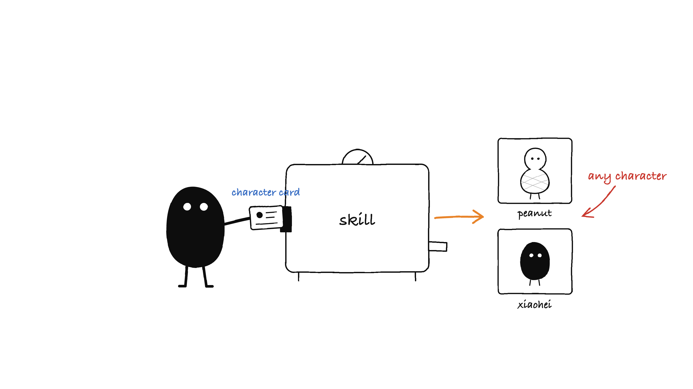
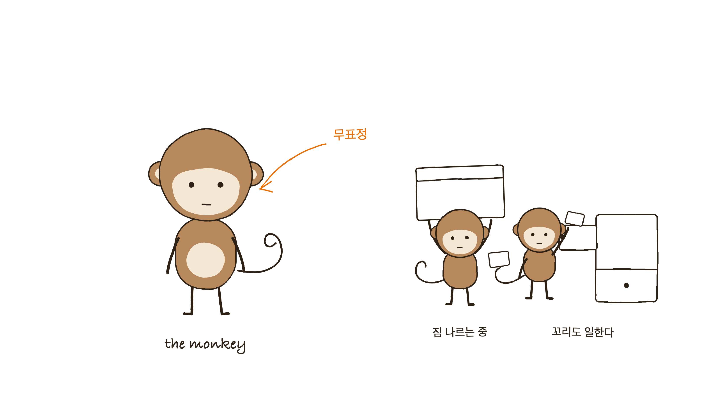
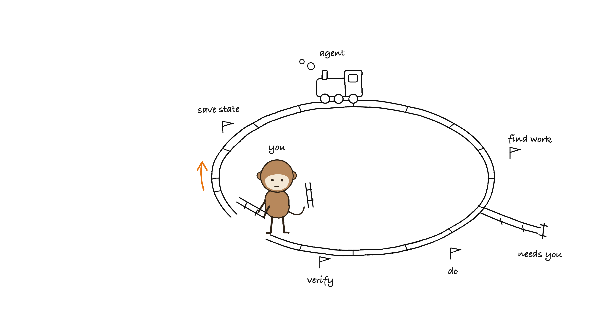
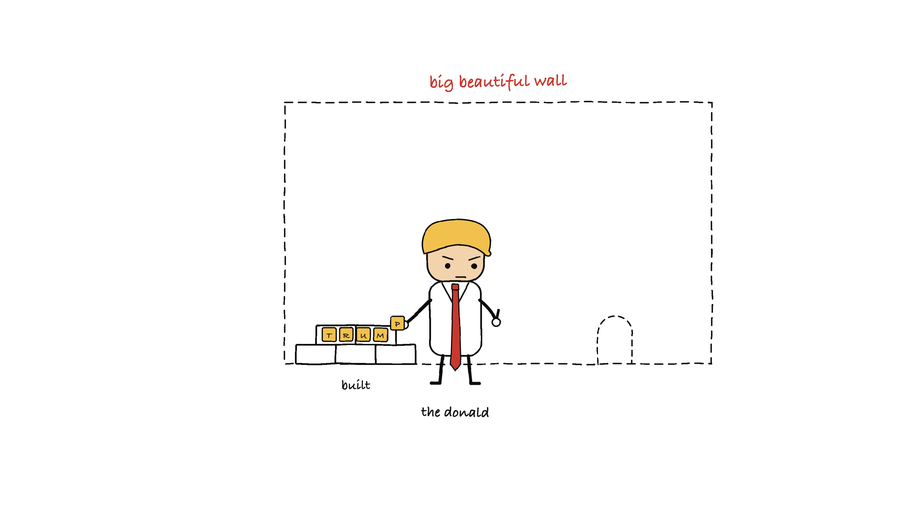
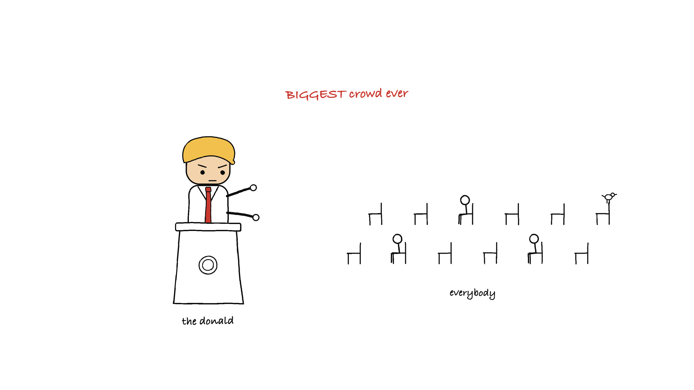

# Character Illustrations

> Hand-drawn, deadpan 16:9 concept illustrations starring a **pluggable recurring character** — a Claude Code skill.
>
> White background | wobbly black line art | restrained accents | one idea per image | character profiles you can swap or invent



## What this is

A [Claude Code](https://claude.com/claude-code) skill that turns an idea — a judgment, process, contrast, state, or metaphor — into a hand-drawn concept illustration that reads in about one second. The recurring character performing the core action is **pluggable**: each character lives as a profile file in `characters/`, carrying its form, personality, action library, palette, SVG recipe, and image-gen prompt block.

This is an adaptation and templatization of [**ian-xiaohei-illustrations**](https://github.com/helloianneo/ian-xiaohei-illustrations) by [Ian Neo](https://github.com/helloianneo) — his skill's architecture (style DNA, composition patterns, prompt template, QA checklist, and the 小黑 character) is the foundation here, generalized so the character is a swappable input rather than a hardcoded IP. The peanut character and watermark script come from [peanut-illustrations](https://github.com/aishwaryaashok14/peanut-illustrations), a skill in the same lineage. See [NOTICE.md](NOTICE.md).

What this adaptation adds:

- **Pluggable characters** — profiles in `characters/` with per-character config (palette mode, accent hexes, label language, watermark) in frontmatter. Describe a new character in one sentence and the skill fills `characters/_TEMPLATE.md` and saves it for reuse.
- **A local SVG rendering backend (default)** — author the illustration as SVG (feTurbulence wobble, hand fonts, the profile's SVG recipe) and render with headless Chrome. Label text is always exact, sources stay editable, and no image-generation model is needed. The original image-gen prompt template remains as an alternative backend.
- **Two palette modes** — `single-accent` (black + one emphasis color) and `semantic-triad` (orange = flow, red = warnings, blue = meta), chosen per character.
- **Multi-actor labeling rules** — every actor in a scene gets named; mechanisms get drawn concretely, not as labeled boxes.
- **Personas** — a character profile can carry an optional voice-and-flair section: label register, catchphrases (max one per image), signature gestures/props, and a staging quirk. The claim-vs-reality gap between what the labels say and what the drawing shows becomes a joke engine.

## Characters included

| Character | Look | Palette |
|---|---|---|
| `peanut` | deadpan in-shell peanut, cross-hatch shell, dot eyes | single warm-orange accent |
| `xiaohei` (小黑) | solid-black creature, white dot eyes | orange / red / blue semantic triad |
| `monkey` | warm-brown monkey, cream face patch, curled working tail | single warm-orange accent |
| `trump` | persona caricature: gold swoop, extra-long red tie, announces instead of labors | single red accent |
| `_TEMPLATE` | copy it to define your own | your call |

## Examples

Adapting a character into the house style (the monkey's debut sheet):



An article illustration (Loop Engineering — "stop prompting the agent; build the loop that prompts the agent"):



A persona character (the Donald — the red label makes the claim, the drawing quietly disagrees):





## Install

Clone straight into your Claude Code skills directory:

```bash
git clone https://github.com/moxordo/character-illustrations.git ~/.claude/skills/character-illustrations
```

The SVG backend needs headless Chrome (any recent Google Chrome). The optional watermark step needs Pillow in a venv.

## Use

Just ask Claude Code:

```text
peanut illustration of "shipping beats polishing"
```

```text
xiaohei illustrations for this article: <paste>   # produces a shot list, then a batch
```

```text
an illustration with a new character: a deadpan traffic cone who directs data
```

The skill composes first (metaphor, character action, labels, composition — a few lines you can veto), then renders, then QA-checks the actual output against `references/qa-checklist.md` and iterates.

## Structure

```text
.
├── SKILL.md                        # workflow: resolve character → digest → compose → draw → QA → save
├── characters/
│   ├── _TEMPLATE.md                # blank profile for new characters
│   ├── peanut.md · xiaohei.md · monkey.md
├── references/
│   ├── style-dna.md                # visual DNA, palette modes, label rules, hard nos
│   ├── composition-patterns.md     # structure types, fresh-metaphor method, anti-copy rules
│   ├── svg-workflow.md             # default backend: SVG + headless Chrome
│   ├── prompt-template.md          # alternative backend: image-gen prompt
│   └── qa-checklist.md             # pass criteria, failure signals, iteration moves
├── scripts/
│   └── add_watermark.py            # exact-text watermark (Pillow)
└── examples/images/
```

## License

MIT — see [LICENSE](LICENSE). Adapted from MIT-licensed work by Ian Neo and Aishwarya Ashok; see [NOTICE.md](NOTICE.md).
